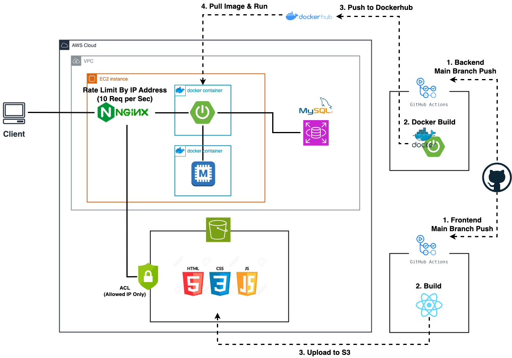

# Link Shortcut Web Frontend

## 기술 스택

- Javascript
- React
- Tailwind CSS

<br />

## 프로젝트 실행

- 프로젝트 최상위 디렉토리에 .env 파일 생성

```text
REACT_APP_HOST=React 서버 주소 (별도 설정없으면 http://localhost:3000)
REACT_APP_SERVER_HOST=API 서버 주소
```

<br />

- 콘솔창에서 다음 명령어를 실행

```cmd
npm install
npm start
```

<br />

## 빌드/배포 자동화 구축


<br /><br />

- main branch에 push될 경우 Github Actions가 작동하여 React 빌드 후 AWS S3에 자동으로 업로드 진행
- NGINX를 통하여 AWS S3에 업로드된 HTML, JS, CSS 파일 배포
- AWS S3의 ACL 설정으로 허용된 IP의 접근만을 허용하여 보안성 향상 및 두 개의 URL로 서비스에 접근하는 것을 제한
